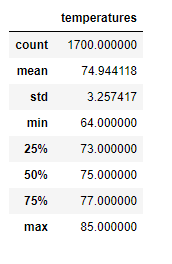
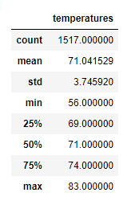

# surfs_up

## Overview of the analysis:

Our client W. Avy would like to open a new Ice Cream & Surf shop and to ensure the success of this business, our investor, would like to review the temperature statistics for June and December. Reviewing these months will ensure a successful year-round business for our Ice Cream and Surf shop.

## Results 

These are the results for the June and December temperatures.

The average June temperature is 74.94 while the average for December is 3 degrees lower at 71.04.
The minimum June temperature is 64 degrees while the December minimum temperate is significantly lower 56.
The maximum June temperature is 85 degrees, and the December maximum temperature is only 2 degree lower 83.

  

## Summary 

It can be determined Ice Cream & Surf shop would have a successful year-round business. Even with a low temperature in December of 56 degrees, the lowest 25% quartile was still averaging 69 degrees. This weather would be warm enough to support the business. Further supporting this is the fact that the average temperatures between June and December only differed by 3 degrees. That shows that the temperatures would be consistent all year long.
